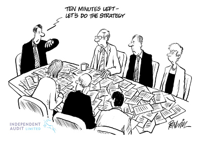

# Gründen

Ein eigenes Produkt, ein eigenes Unternehmen gründen.

Die Schritte hierzu und die möglichen Herausforderungen planen.

Warum will ich gründen?

## Ein Wort über Mich

Jakob Hohlfeld, *27.11.1979 in Erfurt

2008: Heavenseven GbR mit Partnern in Berlin

2009: Kooperation mit zwei Partnern (remote Berlin/Ruhrpott) - reisenleichtgebucht.de

2012: IT Consultant in Wolfsburg

_Schwerpunkte:_

Web Development (PHP, dann Python und Java)

Projektmanagement

Ideation

## Was will ich?

> Build tools that make smart people productive

## Beispiel: Evernote

[Interview][1] mit dem Evernote-Gründer Phil Libin

> “We’re going to make this thing that’s going to let you write things down on computers and phones and we’re going to give it away for free. Can I have $10 million?”

> It’s a much happier way to live your life if you wake up in the morning and you think, “What I am going to build that’s great?”

## Identify a need

Wenn eine Idee geboren wird, kann das z.B. mit der Erfahrung zu tun haben:

> Da könnte ich etwas verbessern

Bedarfe gibt es überall - ...

## The right tool for the right job

... alles eine Frage des Sich-Hineinversetzens.

## Ein paar simple Fragen beantworten:

+ Was kann das Produkt?
+ Wem nutzt es?
+ Ist es dazu geeignet, einen Prozess schlauer / schneller / besser zu gestalten?

## Die ersten Schritte

+ Recherchieren
+ Feedback von Freunden und Bekannten einholen
+ Prototypen bauen

Neue Technologien bieten Chancen und bergen Risiken!

### Risiken

> ["Risky Business 1983"][2]

Das erhoffte Ergebnis tritt nicht ein, der Markt ist noch nicht 'reif', die Early-Adopter sind zu wenige oder lehnen das Produkt ab.

Das Produkt stellt sich als irrelevant heraus, die Technologie wird nicht verstanden.

Falsche Marketing-Strategie, Lack of focus.

### Chancen

Motivation, etwas Neues zu tun

Dinge auf neue Art gedacht ergeben oft interessante und wertvolle Erkenntnisse über althergebrachte Konzepte.

Möglicherweise tue ich mit meiner Zeit etwas Sinnvolleres als ich sonst tun würde.

### Strategie

... um Risiken und Chancen auszugleichen:

+ So früh wie möglich andere Meinungen einholen
+ Scope definieren, ausführlich planen
+ Dafür sorgen, dass das Produkt bekannt wird

## Gesteckte Ziele ereichen

+ Selbstmanagement
+ Projektmanagement
+ Vertrauen durch Kontinuität

> Alles auf der Welt kommt auf einen gescheiten Einfall und auf einen festen Entschluss an. - Johann Wolfgang Goethe

## Benötigte Infrastruktur

Welche technischen Voraussetzungen müssen erfüllt sein?

Welche Mittel werden benötigt, um das Produkt zu Leben zu erwecken?

Kosten kalkulieren.

## Business Case

+ Zielmark-Analyse
+ User befragen, Personas bilden -> Backstory
+ Partnerschaften
+ Fördermittel
+ VC

Das Produkt muss _einfach_ sein und zur Zielgruppe passen.

## Das Produkt zum Leben erwecken

+ Planen, entwerfen, beschreiben
+ Feedback einholen
+ Bauen, früh veröffentlichen
+ Testen, aktiv supporten
+ Schnittstellen anbieten
+ Netzwerk ausbauen

Feedback ist das A und O!

## Verkaufen

+ Verkaufen verkaufen verkaufen
+ Naming & Design
+ relevante Kanäle bedienen
+ vernünftiger Support
+ B2B: fanatical Support, Sales
+ strategische Partnerschaften

[1]: http://www.wired.com/business/2013/07/evernote-10-questions/
[2]: http://www.imdb.com/title/tt0086200/
